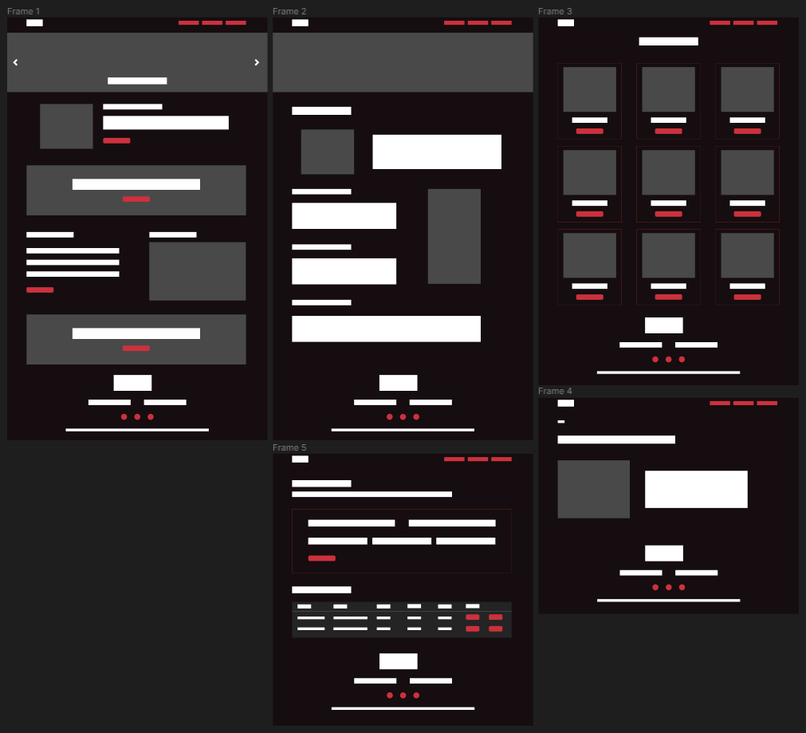
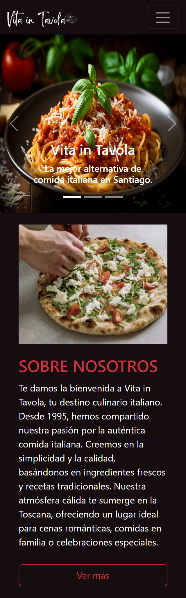

Proyecto 4: Aplicación Restaurant
# Restaurant Vita in Tavola

## **Descripción:**
La idea de este proyecto es la creación de una aplicación web para un restaurante que incluya un home, página de información sobre el restaurant, un menú y sección de reservas; además de que sea responsive.

Primero se diseñó un prototipo visual simple de la aplicación.


Versión Final:



## **Features:**
Para el desarrollo del proyecto se utilizaron diferentes tecnologías, tales como:

**Diseño**
- Aplicación Figma: Para el desarrollo del diseño inicial de la página web.

**UI**
- React Bootstrap: Incorporación de variados componentes del framework para agilizar el desarrollo del prototipo y que sea responsive.
- Material Icons: Para la incorporación de íconos.

**Desarrollo**
- Vite: Para la creación del entorno de desarrollo.
- React: Para trabajar la UI en base a componentes.
- React Router: Crear y gestionar rutas dinamicas.
- Firestore: Manejo de datos en la nube.

## **Objetivos:**
El enfoque principal del proyecto es desarrollar una aplicación web con React y Firebase; y más específicamente:
1. Uso de Vite para generar la aplicación.
2. Uso de React (props, hooks).
3. Aplicar React Router para manejo de rutas.
4. Firestore para manejo de datos.

## **Demo:**
A continuación, se presenta un enlace a la demo del proyecto.

## **Uso:**
1. Descargar proyecto.
2. Abrir la carpeta del proyecto en un editor de código.
3. Instalar las dependencias con el siguiente codigo en la terminal:
```
npm install
```
4. Para ver la aplicación correr el comando:
```
npm run dev
```